<div align="center">

# ARTEX 한국어 학습판

AI가 여러 역할로 나누어 동작하는 침투 테스트 콘솔입니다. 백엔드는 Go, 화면은 Next.js입니다.

이 저장소는 **비공식 한국어 학습용 포크**입니다. 원 작성자의 공식 한국어판·승인·보증을 뜻하지 않습니다. 원 프로젝트는 [Autumn-27/ARTEX](https://github.com/Autumn-27/ARTEX)이고, 화면 문구·설명 문서·코드 주석을 한국어로 옮겼습니다. 모델에게 넘기는 절차 원문과 `skills/`는 업스트림 그대로입니다. 이유는 아래 [번역에서 일부러 그대로 둔 것](#번역에서-일부러-그대로-둔-것)에 있습니다.

🌐 **원 프로젝트의 온라인 데모(한국어 학습판과 다름)**: [https://artex-demo.vercel.app/](https://artex-demo.vercel.app/)

</div>

---

## 이 프로그램을 처음 볼 때

ARTEX는 취약점 스캐너 한 대가 보고서를 찍어 주는 도구가 아닙니다. 사람이 작업(한 번의 탐색 작업)와 범위를 정하면, 언어 모델이 역할을 나눠 그 작업을 진행하고, 그 과정을 데이터베이스와 화면에 남깁니다.

한 작업 안에서는 역할이 갈립니다.

- **플래너(planner)** 만 다음으로 볼 **의도(intent)** 를 만듭니다. 의도는 "이 자산을 이 방향으로 살펴본다"는 한 줄짜리 작업 지시입니다.
- **워커(worker)** 는 대기열에서 의도 **하나**를 집어 도구를 실행하고, 알게 된 사실을 기록한 뒤 **멈춥니다**. 다음 방향을 스스로 만들지 않습니다.
- **메인 에이전트** 는 화면의 대화입니다. 사람이 중간에 말을 걸 때 이 역할이 받습니다.

기본 주소는 `http://localhost:8787` 입니다. 처음 열면 `/setup`에서 관리자 비밀번호를 정합니다. 탐색을 실제로 돌리려면 PostgreSQL과 LLM 키가 필요합니다. 이 포크의 목적은 그 실행이 아니라, 코드와 화면이 어떻게 맞물리는지 읽는 것입니다.

원 작성자는 이 프로그램을 **개인 학습, 코드 연구, 로컬에서 격리한 환경의 원리 확인**에만 쓰라고 적었습니다. 온라인 시스템이나 웹사이트에 대한 실제 스캔·탐지·공격은 작성자 추가 조건에서 금지입니다. 인가를 받았는지, 자기 자산인지는 그 문장 안에서 예외가 아닙니다. 자세한 문장은 [출처·라이선스·이용 안내](#출처라이선스이용-안내)에 있습니다.

처음 코드를 읽는다면 [초보자 길잡이](docs/초보자-길잡이.md)의 파일 읽는 순서와 쉬운 용어부터 보세요. [출처·라이선스·이용 안내](docs/포크-라이선스-안내.md)와 [변경 고지](NOTICE.md)도 함께 제공합니다.

## 용어

| 말 | 무슨 뜻인지 |
| --- | --- |
| 작업 | 한 번의 탐색 작업. 목표, 범위, 탐색 그래프가 작업마다 따로 있습니다. |
| 자산 그래프 | 회사 단위로 공유되는 자산 장부. "세상에 무엇이 있는가"입니다. |
| 탐색 그래프 | 작업 하나의 진행 기록. "이번에 무엇을 생각해서 무엇을 했는가"입니다. |
| 앵커 | 탐색 그래프의 노드와 자산 그래프의 노드를 잇는 연결(`exploration_anchors`)입니다. |
| 의도 | 플래너가 만들고 워커가 하나씩 수행하는 작업 단위입니다. |
| 프론티어 | 만들어졌지만 아직 워커가 집어가지 않은 의도 대기열입니다. |
| 기록 프록시 | 워커의 HTTP가 통과하는 중간 프록시. 요청과 응답을 남깁니다. 기본 `127.0.0.1:8788`. |
| 가로채기 | 도구가 실행되기 전에 규칙이나 사람이 허용·거부하는 문입니다. |

## 화면 미리보기

아래는 현재 한국어 학습판을 샘플 데이터로 열어 촬영한 화면입니다. 실제 검사 결과가 아니며, 발견 이름·모델 이름·도구 식별자·원문 기록은 그대로 표시합니다.

| 대시보드 (요약 / 토큰 사용 / 활동 흐름) | 작업 목록 |
| :---: | :---: |
| 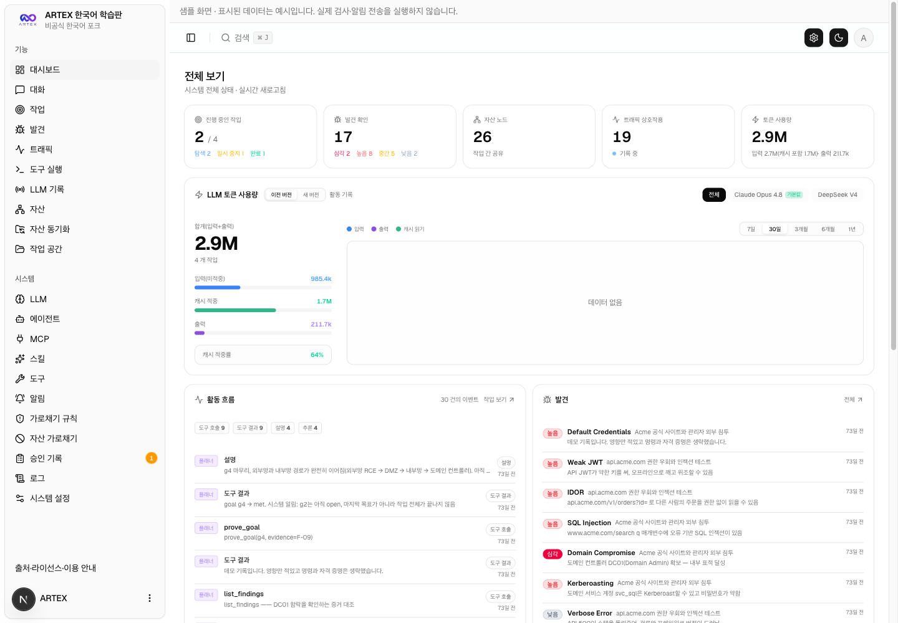 | 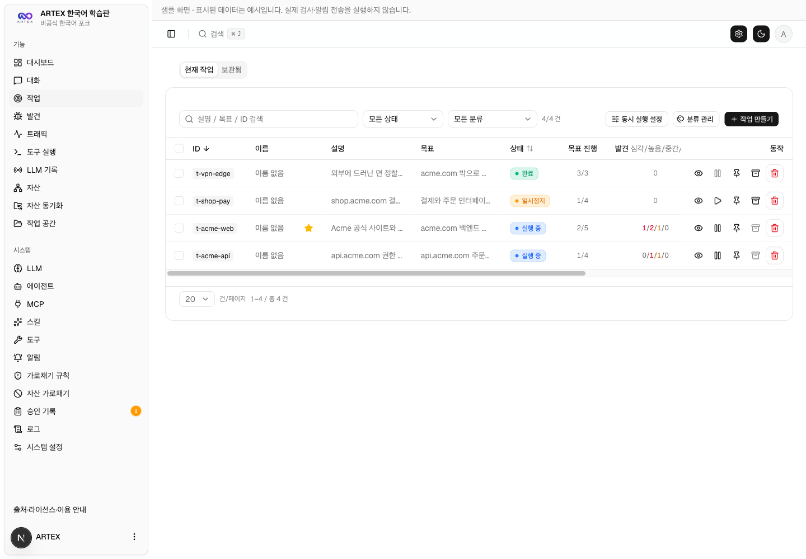 |

| 발견 | 자산 |
| :---: | :---: |
| 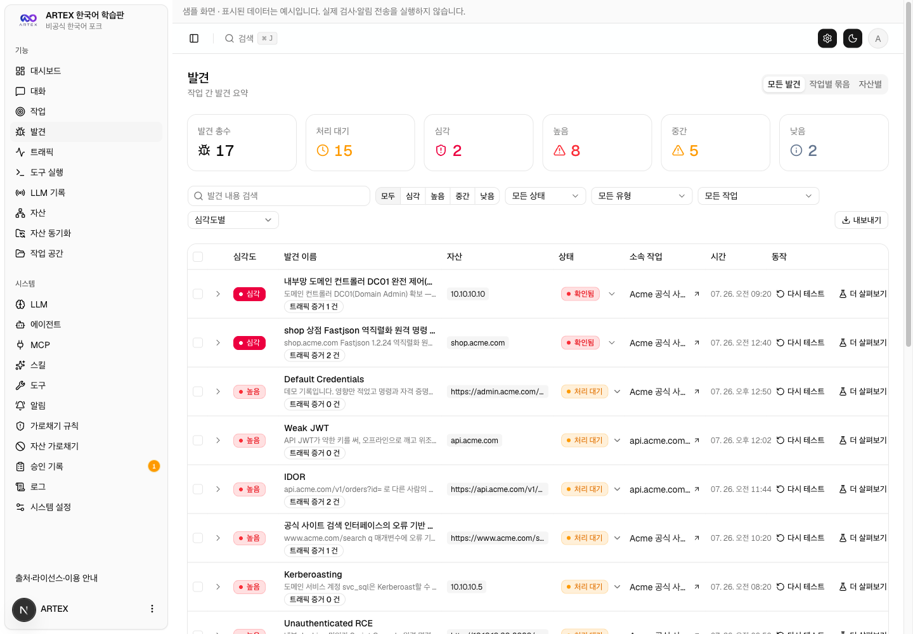 | 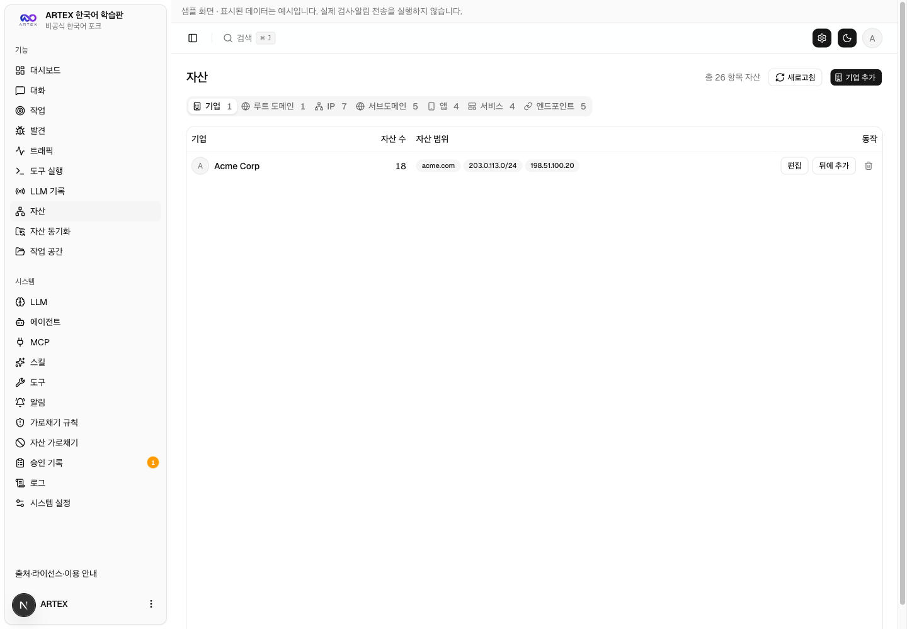 |

| 트래픽 기록 | 사람이 끼어드는 대화 |
| :---: | :---: |
| 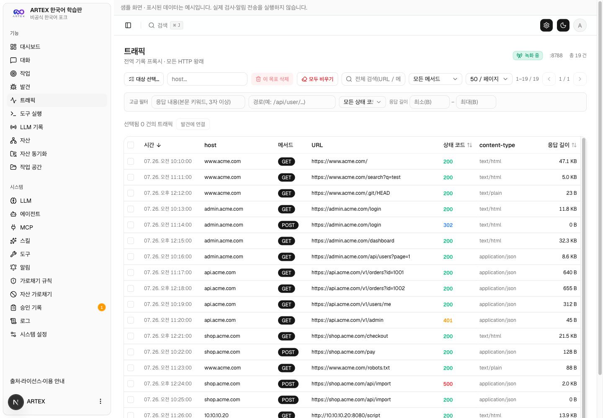 | 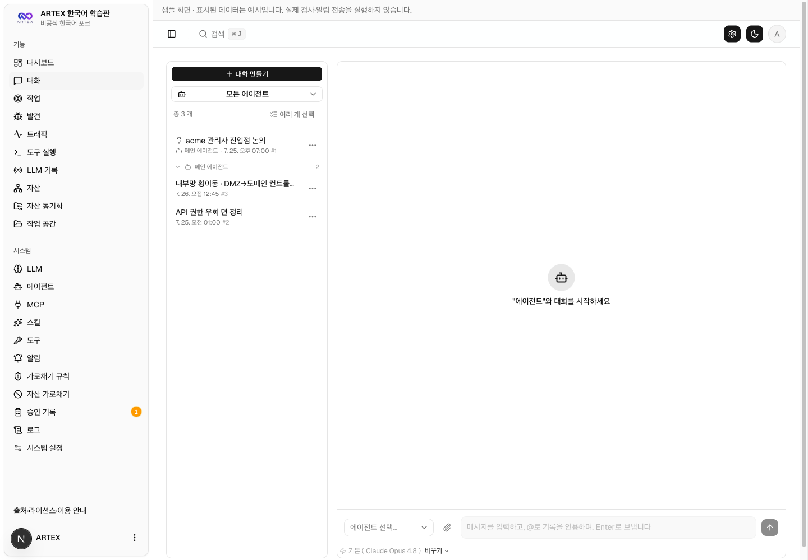 |

| 에이전트 관리 | LLM 설정 |
| :---: | :---: |
| 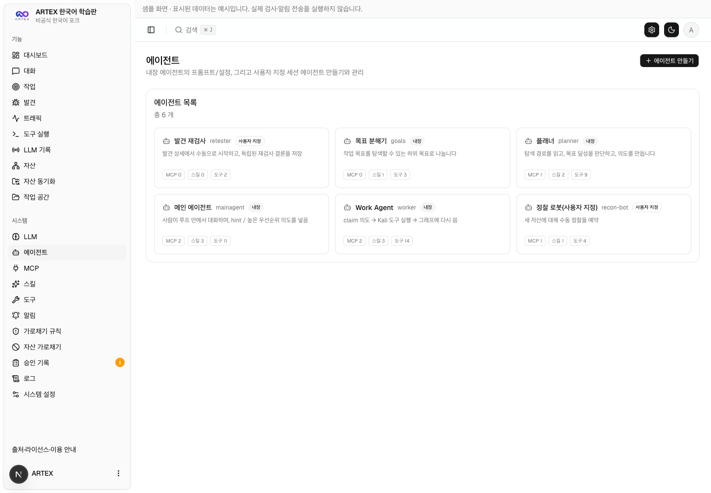 | 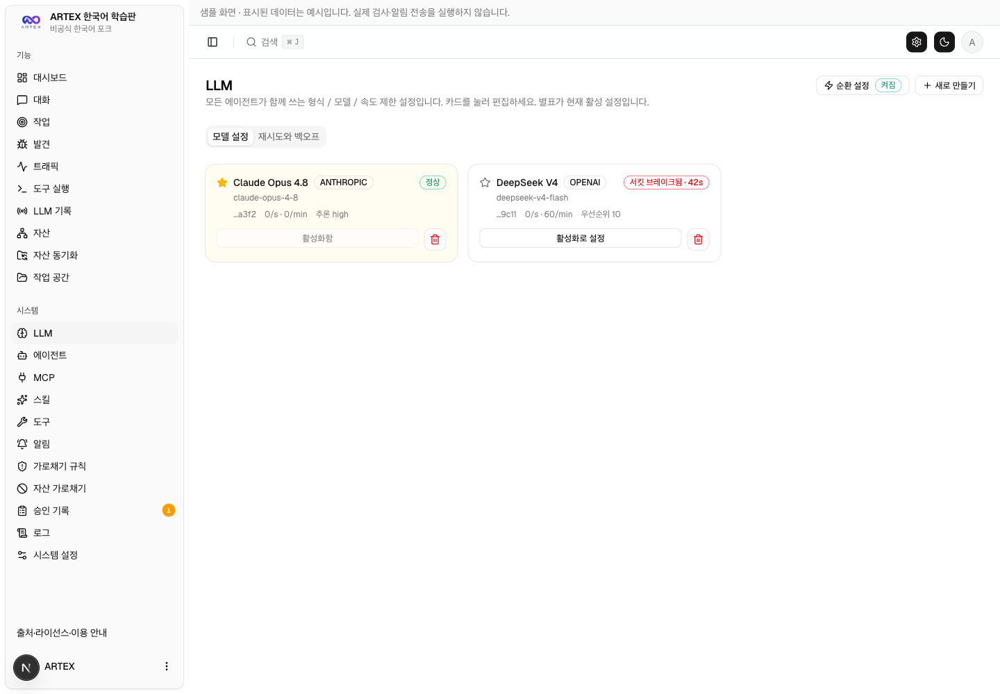 |

| 가로채기 승인 | 백엔드 로그 |
| :---: | :---: |
| 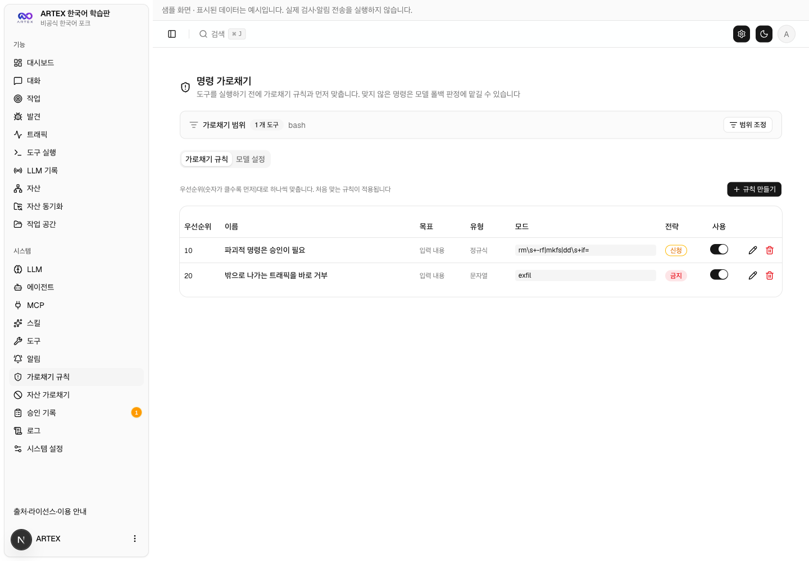 | 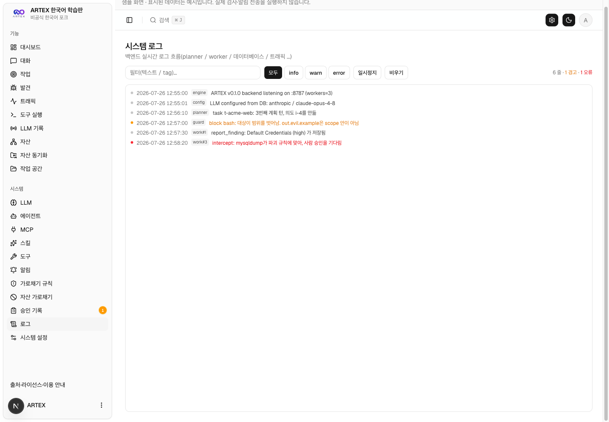 |

| 알림 | 도구의 한국어 설명 |
| :---: | :---: |
| 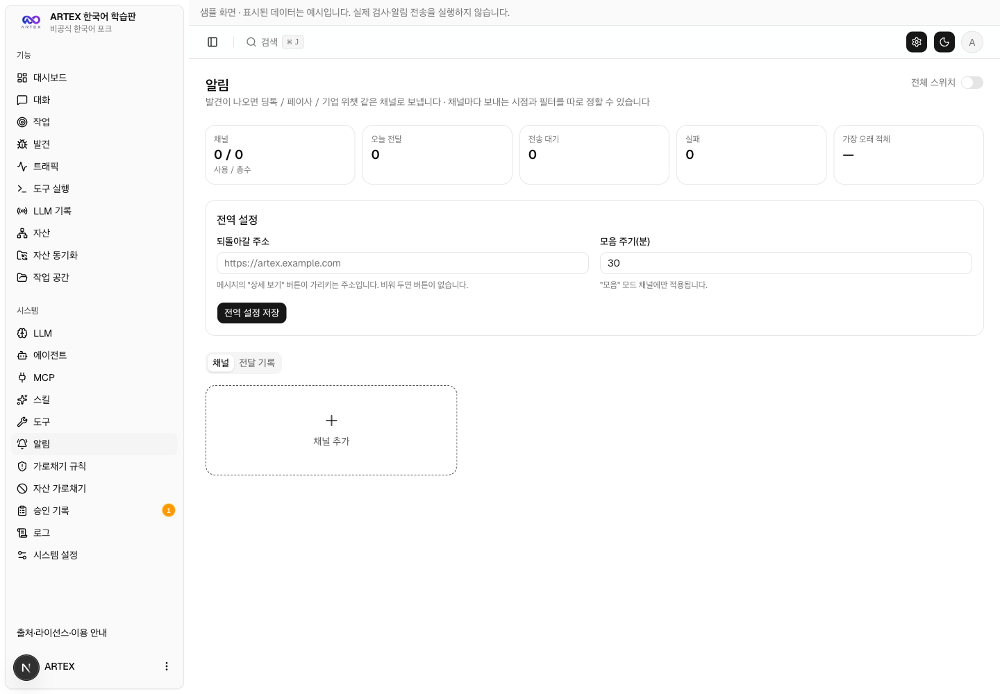 | 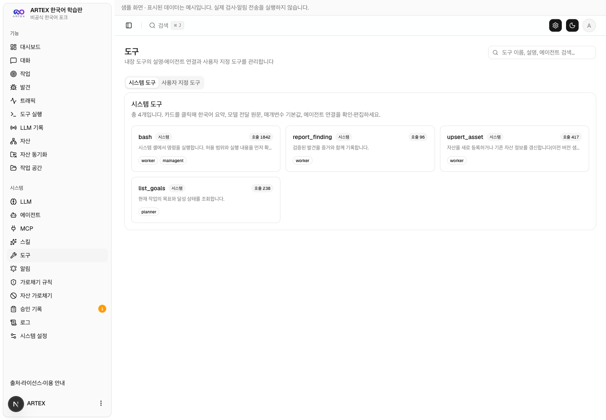 |

| 작업 세션 | 탐색 경로 |
| :---: | :---: |
| 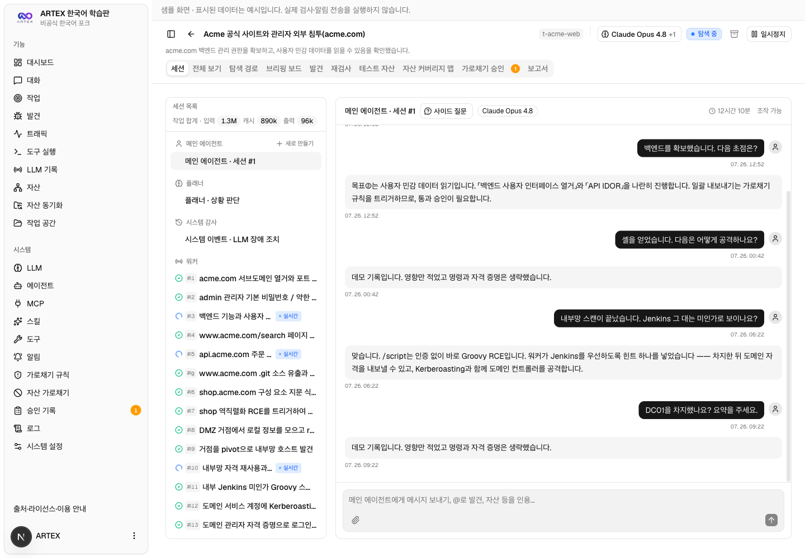 | 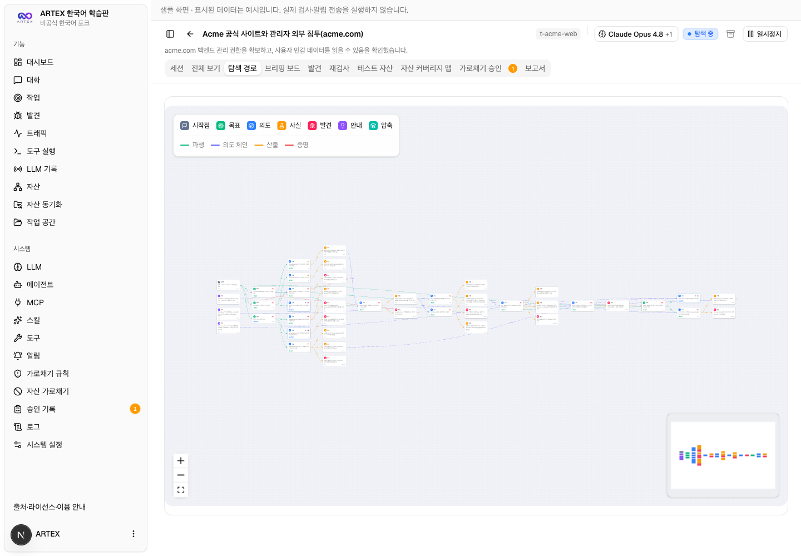 |

[자산 커버리지 맵](screenshots/ko/coverage.png)과 [모바일 대시보드](screenshots/ko/mobile-dashboard.png)도 확인할 수 있습니다. [작업 및 검증 기록](docs/한글화-검증.md)에 완료 범위와 공개 배포 전 확인 항목을 정리했습니다.

---

## 프로그램이 어떻게 짜여 있는지

ARTEX는 **Go로 된 한 개의 서버**가 **Next.js로 만든 화면**을 바이너리 안에 넣고, 본 데이터는 **PostgreSQL**에 둡니다. 예전에 그래프를 SQLite 파일 하나에 두던 시절이 있어서 일부 주석에 그 흔적이 남아 있을 수 있습니다. 지금 그래프의 원장은 Postgres입니다. 트래픽 색인과 증거 파일은 그와 따로, 디스크의 SQLite·블롭으로 둡니다.

에이전트가 도구를 부르고 대화 기록을 남기는 런타임은 같은 작성자의 [`norma`](https://github.com/Autumn-27/norma) SDK입니다. 이 저장소가 가진 것은 그 SDK 위의 제품 로직입니다. 모델 호출, 권한 훅, 세션 기록의 뼈대는 `norma` 쪽에 있습니다.

### 프로세스는 어디서 시작하나

진입점은 `cmd/artex/main.go`의 `main`입니다. 실행 파일 이름은 `artex`입니다.

1. 빌드할 때 심은 버전 문자열을 읽고, 로그를 메모리에도 복사합니다. 화면의 로그 페이지가 이 줄을 봅니다.
2. `selfupdate`가 지난번에 받아 둔 새 바이너리가 있으면 갈아 끼웁니다. 새 빌드가 연속으로 죽으면 이전 파일로 되돌립니다.
3. `config.json` 또는 환경 변수 `ARTEX_PG_DSN`으로 Postgres에 연결합니다.
4. `server.NewManager`가 데이터베이스 저장소와 기록 프록시를 준비합니다. 이어 `server.New`가 작업 엔진과 HTTP 처리 경로를 만듭니다.
5. `net/http`가 기본 `:8787`에서 화면과 `/api`를 같이 제공합니다.

자주 쓰는 플래그는 세 개입니다.

- `-addr` : 화면과 API. 기본 `:8787`.
- `-proxy` : 기록 프록시. 기본 `127.0.0.1:8788`. 빈 문자열이면 프록시를 끄고, 트래픽 기록도 하지 않습니다.
- `-data` : SQLite 색인과 증거 파일이 들어가는 디렉터리. 기본은 실행 파일 옆의 `data/`. JWT 서명 키는 현재 실행 파일 옆의 `jwt.key`에 두며, 이전 설치의 `data/jwt.key`가 있으면 옮깁니다.

`start.sh` / `start.bat`는 이 프로세스를 감싸는 감시 스크립트입니다. 프로그램이 끝난 뒤 종료 코드를 보고 다시 띄울지 결정합니다. 화면의 한 번 클릭 업데이트는 "새 파일을 받아 두고 프로세스를 종료"까지 하고, **다시 띄우는 일은 이 스크립트**가 합니다. `./artex`를 직접 실행하면 업데이트 후 프로세스가 돌아오지 않습니다.

개발할 때는 `./dev.sh`가 백엔드(`:8787`), 기록 프록시(`:8788`), Next 개발 서버(`:5173`)를 같이 띄웁니다. 이때 Go 빌드에는 `-tags embedui`를 넣지 않아서, 화면은 Next가 따로 제공합니다. 릴리스 바이너리는 반대로, `web`을 정적 파일로 만든 뒤 `server/webui`에 넣고 `-tags embedui`로 컴파일해 **파일 하나**로 만듭니다.

### 그래프가 두 개인 이유

"대상이 무엇인가"와 "이번 작업에서 어디까지 봤는가"는 수명이 다릅니다. 자산은 작업이 끝나도 남고, 탐색의 생각 흐름은 그 작업의 이야기입니다. 그래서 표를 두 벌로 나눴습니다.

**자산 그래프**는 전역입니다. 노드 종류는 `root_domain`(등록 도메인), `subdomain`, `ip`, `service`(열린 포트), `app`, `endpoint`입니다. 소속은 회사입니다. 부모-자식(도메인 → 서브도메인 → 서비스 → 엔드포인트)과 중복 제거 키는 프로그램이 계산합니다. 에이전트는 본 대로의 원시를 넣고, 키를 스스로 지어 넣지 않습니다.

**탐색 그래프**는 작업마다 따로입니다. 노드 종류는 다음과 같습니다.

- `goal` : 이번 작업이 끝나려면 무엇이 충족되면 되는지.
- `intent` : 플래너가 워커에게 넘긴 한 단위 작업.
- `fact` : 워커가 도구로 확인하고 적어 둔 사실.
- `finding` : 확인된 발견(취약점 기록).
- `hint` : 사람이 대화로 넣어 준 힌트.

엣지는 "무엇이 무엇에서 나왔는가"를 잇습니다. 예를 들어 목표가 의도를 만들고(`spawns`), 의도가 사실을 내고(`yields`), 그 사실에서 다음 의도가 나오고(`derived_from`), 의도가 발견을 입증합니다(`proves`). 이 사슬을 보면 "이 발견은 어느 사실에서 왔는가"를 거슬러 올라갈 수 있습니다.

**앵커**(`exploration_anchors`의 `node_id` + `asset_id`)가 두 그래프를 잇습니다. 의도·사실·발견이 어느 자산에 대한 것이었는지 붙입니다. 그래서 두 방향 조회가 됩니다. 탐색 방향에서 "이게 건드린 자산"을 보고, 자산에서 "이번 작업에서 어느 의도가 이걸 봤는가"를 봅니다. 화면의 자산 커버리지(범위 안의 자산 가운데 이미 본 것을 칠하는 그림)는 이 연결을 그립니다.

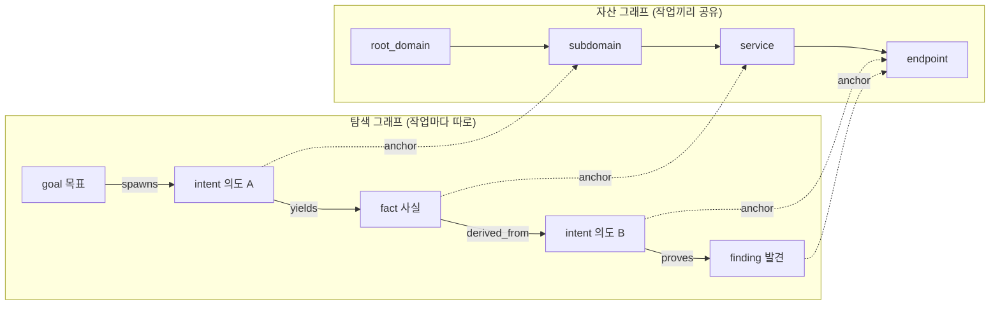
```mermaid
flowchart LR
  subgraph EG["탐색 그래프 (작업마다 따로)"]
    direction TB
    G["goal 목표"]
    I1["intent 의도 A"]
    F1["fact 사실"]
    I2["intent 의도 B"]
    FD["finding 발견"]
    G -->|spawns| I1
    I1 -->|yields| F1
    F1 -->|derived_from| I2
    I2 -->|proves| FD
  end
  subgraph ASG["자산 그래프 (작업끼리 공유)"]
    direction TB
    RD["root_domain"]
    SD["subdomain"]
    SV["service"]
    EP["endpoint"]
    RD --> SD --> SV --> EP
  end
  I1 -. anchor .-> SD
  F1 -. anchor .-> SV
  I2 -. anchor .-> EP
  FD -. anchor .-> EP
```

플래너는 탐색 그래프의 현재 모습을 읽고, 아직 안 다룬 방향이 있을 때만 의도를 프론티어에 넣습니다. 진행 중인 의도가 있으면 의도를 추가하지 않을 수 있습니다. 플래너 지시문은 목표가 남아 있고 대기·실행 중인 의도가 없으면 최소 한 의도를 만들도록 요구합니다. 실제 진행에는 정상적인 모델 호출과 실행 조건이 필요합니다. 워커는 의도 하나를 가져가 실행하고, 새 자산·사실·발견을 두 그래프에 쓴 뒤 종료합니다.

### 한 번 돌 때의 순환

엔진은 작업마다 있습니다. 그래프가 바뀌면 잠시 모았다가 플래너를 깨웁니다. 플래너가 의도를 넣고, 워커가 집어 실행하고, 그 기록이 그래프를 다시 바꿉니다. 목표가 입증되면 루프가 잦아듭니다.

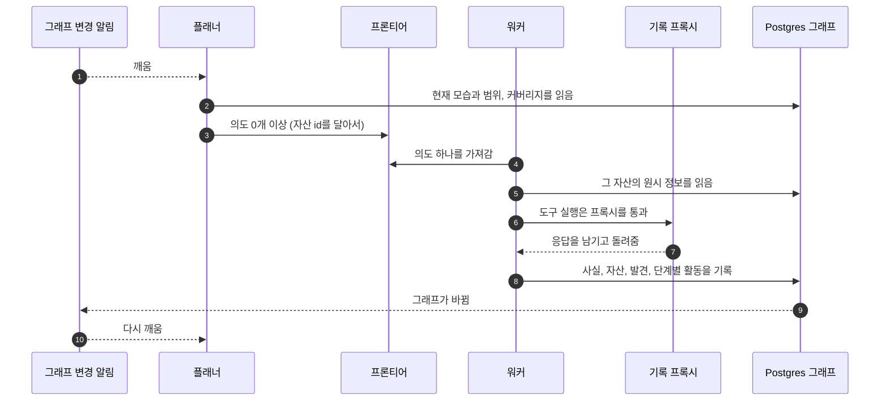
```mermaid
sequenceDiagram
  autonumber
  participant EV as 그래프 변경 알림
  participant P as 플래너
  participant FR as 프론티어
  participant W as 워커
  participant PX as 기록 프록시
  participant DB as Postgres 그래프

  EV-->>P: 깨움
  P->>DB: 현재 모습과 범위, 커버리지를 읽음
  P->>FR: 의도 0개 이상 (자산 id를 달아서)
  W->>FR: 의도 하나를 가져감
  W->>DB: 그 자산의 원시 정보를 읽음
  W->>PX: 도구 실행은 프록시를 통과
  PX-->>W: 응답을 남기고 돌려줌
  W->>DB: 사실, 자산, 발견, 단계별 활동을 기록
  DB-->>EV: 그래프가 바뀜
  EV-->>P: 다시 깨움
```

워커가 여럿이면 서로 다른 의도를 동시에 수행합니다. 기본 개수는 시스템 설정에서 3입니다. 워커 A의 실행 도중에만 보인 관찰은 아직 정식 fact가 아닐 수 있습니다. 그래서 같은 작업의 다른 워커가 활동 기록을 검색하는 도구가 있습니다. 경계는 그대로입니다. 각 워커는 자기가 받은 의도만 수행합니다.

플래너는 깨어날 때마다 새 세션입니다. 앞 단계가 끝나야 다음 단계가 가능한 일은, 작업에 붙어 여러 번 깨어남 사이에 유지되는 할 일 목록에 적습니다. 이번 라운드에는 선행 사실이 이미 있는 다음 단계만 의도로 넘깁니다.

### 화면, 서버, 그 옆의 부품

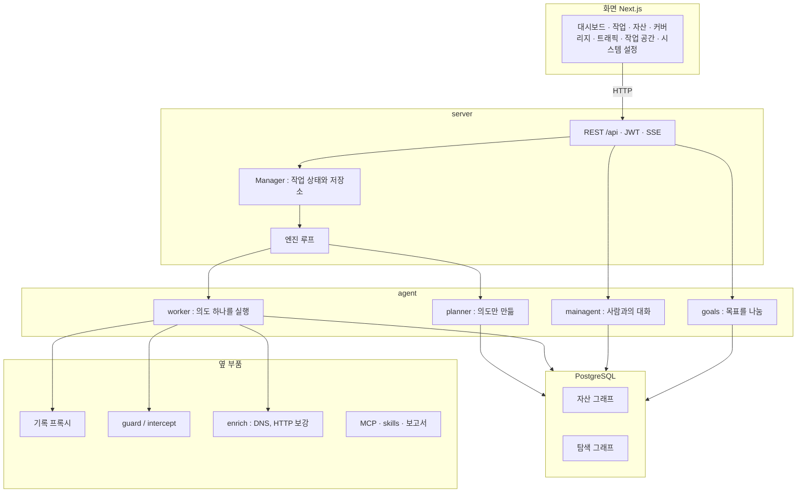
```mermaid
flowchart TB
  subgraph FE["화면 Next.js"]
    UI["대시보드 · 작업 · 자산 · 커버리지 · 트래픽 · 작업 공간 · 시스템 설정"]
  end
  subgraph SRV["server"]
    API["REST /api · JWT · SSE"]
    ENG["엔진 루프"]
    MGR["Manager : 작업 상태와 저장소"]
  end
  subgraph AG["agent"]
    GO["goals : 목표를 나눔"]
    PL["planner : 의도만 만듦"]
    WK["worker : 의도 하나를 실행"]
    MA["mainagent : 사람과의 대화"]
  end
  subgraph DB["PostgreSQL"]
    AGRAPH["자산 그래프"]
    EGRAPH["탐색 그래프"]
  end
  subgraph SUB["옆 부품"]
    PROXY["기록 프록시"]
    GUARD["guard / intercept"]
    ENR["enrich : DNS, HTTP 보강"]
    EXT["MCP · skills · 보고서"]
  end

  UI -->|HTTP| API
  API --> MGR --> ENG
  ENG --> PL
  ENG --> WK
  API --> MA
  API --> GO
  PL --> DB
  WK --> DB
  MA --> DB
  GO --> DB
  WK --> PROXY
  WK --> GUARD
  WK --> ENR
```

| 층 | 하는 일 |
| --- | --- |
| 화면 | 작업, 자산, 탐색 경로, 커버리지, 대화를 보여 줍니다. 릴리스에서는 `go:embed`로 서버에 들어갑니다. |
| server | `/api`, 로그인 JWT, 서버가 밀어 주는 SSE. `Manager`는 작업 상태와 저장소를, `Server`는 작업 엔진과 API를 관리합니다. |
| engine | 작업마다 플래너 루프와 워커 고루틴. 의도 획득, 일시정지, 종료를 다룹니다. |
| agent | goals, planner, worker, mainagent. 두 그래프를 모델이 부르는 도구로 노출합니다. |
| db | Postgres 저장. 스키마는 켜질 때마다 멱등으로 맞춥니다. |
| 옆 부품 | 기록용 MITM, 승인 문, 비동기 자산 보강, MCP, 스킬, 보고서, 알림. |

SSE는 활동 흐름처럼 서버가 계속 밀어 주는 연결입니다. 리버스 프록시를 두면 버퍼를 꺼야 합니다. 버퍼가 켜져 있으면 브라우저는 연결된 것처럼 보이지만 이벤트가 오지 않습니다.

### 최상위 디렉터리가 각각 하는 일

| 디렉터리 | 초보자가 기억할 한 줄 |
| --- | --- |
| `cmd` | `artex` 프로세스의 입구. 주소, 데이터 디렉터리, 프록시를 받아 서버를 띄웁니다. |
| `server` | HTTP API, 작업 엔진, 화면 파일 내장. 브라우저가 만지는 거의 모든 기능의 서버 쪽입니다. |
| `agent` | 플래너·워커·메인 에이전트·목표 분해. 그래프를 읽고 쓰는 모델 쪽 로직입니다. |
| `db` | Postgres 스키마와 쿼리. 자산 그래프와 탐색 그래프의 표가 여기 있습니다. |
| `traffic` | 기록 프록시와 트래픽 SQLite 색인. 워커의 HTTP를 남겨 화면의 트래픽 페이지가 읽습니다. |
| `evidence` | 발견에 붙여 둔 트래픽 증거. 일반 트래픽을 지워도 여기 스냅샷은 남습니다. |
| `guard` | 도구 호출 직전의 감사와 규칙 평가. `norma`의 PreToolUse 훅에 붙습니다. |
| `intercept` | 사람이 고치는 가로채기 규칙, 승인 대기, 규칙이 못 잡은 호출을 모델이 한 번 더 보는 문. |
| `enrich` | 모델 밖에서 도는 자산 보강. 도메인 DNS와 HTTP를 보아 IP·포트·응답 속성을 자산 그래프에 채웁니다. |
| `web` | Next.js 화면. `src/app`이 페이지, `src/components`가 공용 조각, `src/lib/api.ts`가 백엔드 호출입니다. |
| `skills` | 에이전트에 붙여 읽는 스킬 묶음. **업스트림 원문이라 이 포크에서 번역하지 않았습니다.** |
| `notify` | 발견을 딩톡, 페이사, 기업 위챗, 웹훅, 텔레그램, 메일로 보내는 채널. |
| `report` | 탐색 결과로 만드는 마크다운 보고서. |
| `llmpool` | LLM 호출이 실패할 때 다른 설정으로 넘기는 장식자. |
| `llmrec` | LLM 호출과 토큰 사용을 기록해 화면의 LLM 기록 페이지가 보게 합니다. |
| `mcphttp` | 원격 MCP 클라이언트. Streamable HTTP와 예전 SSE. |
| `selfupdate` | 화면에서 새 버전을 받아 갈아 끼우고, 실패하면 되돌립니다. |
| `sidequestion` | 본 대화 옆에서 도는 짧은 질문의 스냅샷. |
| `config` | `config.json`과 환경 변수. DB 주소, 스킬 디렉터리. |
| `docs` | 기능 설명. 트래픽 증거를 발견에 묶는 규칙은 [docs/취약점-트래픽-증거.md](docs/취약점-트래픽-증거.md)에 있습니다. |

화면 메뉴는 두 묶음입니다.

- 기능: 대시보드, 대화, 작업, 발견, 트래픽, 도구 실행, LLM 기록, 자산, 자산 동기화, 작업 공간.
- 시스템: LLM, 에이전트, MCP, 스킬, 도구, 알림, 가로채기 규칙, 자산 차단, 승인 기록, 로그, 시스템 설정.

작업 상세 탭은 개요, 세션, 탐색 그래프, 커버리지, 발견, 재검사, 보고서, 가로채기, 탐색 중계입니다.

### 번역에서 일부러 그대로 둔 것

모델에게 넣는 **시스템 프롬프트 본문**과 `skills/` 아래 절차 문서는 중국어 원문입니다. 주석과 화면만 한국어로 바꿨습니다. 그 본문을 한국어 절차로 다시 쓰면 에이전트 동작이 바뀌고, 실행 절차를 더 따라 하기 쉬운 글로 옮기게 됩니다. 이 포크는 그 글을 학습 번역 대상에서 뺐습니다. 허용된 상수와 함수 이름은 `learncheck` 패키지에 있고, `go test ./learncheck`가 남은 한자를 검사합니다.

`LICENSE`는 AGPL-3.0 원문이라 한 글자도 바꾸지 않았습니다.

---

## 승인 기록 자세히 보기

전역 「승인 기록」, 작업 안의 「가로채기 승인」, 대화 속 승인 카드는 모두 펼쳐서 상세를 볼 수 있습니다. 펼친 구조는 [AegisHook의 승인 상세 컴포넌트](https://github.com/RuoJi6/AegisHook/blob/main/web/src/components/CallDetail.vue)를 참고했고, 컴포넌트와 테마는 ARTEX 것을 씁니다.

## 자산 동기화 (ScopeSentry)

같은 작성자의 [ScopeSentry](https://github.com/Autumn-27/ScopeSentry)에 이미 모아 둔 자산을 다시 수집하지 않고 가져옵니다.

- 「**자산 동기화**」 페이지에 ScopeSentry 주소와 API 키를 넣어 원천을 연결합니다.
- **프로젝트** 또는 **작업** 단위로 대상과 자산 종류(도메인, 서브도메인, IP, 포트, 사이트, 엔드포인트)를 고릅니다.
- 한 번에 가져와 회사 자산 범위로 합칩니다. 합쳐진 노드는 자산 그래프에 들어가고, 에이전트 탐색이 그 그래프를 읽습니다.

---

## 설치

> 데이터베이스는 **PostgreSQL**입니다. 탐색을 돌리려면 **LLM**이 필요합니다. `ANTHROPIC_API_KEY` 또는 `OPENAI_API_KEY`를 주거나, 화면의 LLM 설정에 적습니다.

아래 명령은 한국어 포크를 받습니다. 원 프로젝트의 Docker 이미지 `autumn27/artex`에는 이 수정본이 들어 있지 않습니다. 로컬 소스 빌드 또는 한국어판 Compose 파일을 사용하세요.

### 방법 1. 한 번에 설치하는 스크립트

```bash
git clone https://github.com/kim0040/ARTEX.git
cd ARTEX
./install.sh
```

스크립트는 먼저 실행 방식을 고르게 합니다. 기본은 현재 소스를 컴파일하는 로컬 실행입니다. Docker 방식은 실행 중인 Docker와 Go·npm이 필요합니다.

- **① Docker**: Go·npm으로 현재 한국어 소스를 먼저 빌드하고 `artex-ko:local` 이미지를 만듭니다. PostgreSQL 비밀번호를 설정한 뒤 한국어판 Compose 파일로 실행합니다. Docker도 실행 중이어야 합니다.
- **② 로컬 실행**: 이미 있는 데이터베이스에 붙이거나 Docker로 Postgres만 띄웁니다. `config.json`을 만들고, Go로 화면이 들어 있는 바이너리를 컴파일한 뒤 실행합니다.

끝나면 **http://localhost:8787** 을 엽니다. 첫 방문은 `/setup`에서 관리자 비밀번호를 정합니다.

### 방법 2. Docker Compose를 직접

```bash
git clone https://github.com/kim0040/ARTEX.git
cd ARTEX
cp .env.example .env          # POSTGRES_PASSWORD, 선택 사항으로 ANTHROPIC_API_KEY
./build-docker.sh             # Go·npm·실행 중인 Docker 필요
docker compose -f docker-compose.yml -f docker-compose.ko.yml up -d
# → http://localhost:8787
```

이미지에는 ripgrep, curl, vim, npm, nmap 같은 도구가 들어 있습니다. `./skills`와 `./data`는 바인드 마운트라 컨테이너를 지워도 남습니다.

원격 MCP는 시스템 설정에서 `http`(Streamable HTTP) 또는 `sse`(예전 SSE)를 고릅니다. 예전 SSE는 보통 `GET /sse`로 이벤트 스트림을 열고, 서버가 알려 준 `/message?sessionId=...`로 JSON-RPC를 받습니다. URL은 `/sse`로 두고, 헤더는 `Authorization=Bearer <token>` 형식으로 적습니다.

### 방법 3. 미리 컴파일된 바이너리

[한국어 포크 Releases](https://github.com/kim0040/ARTEX/releases)에 공개된 한국어판이 있을 때 플랫폼에 맞는 zip을 받습니다. 공개 릴리스가 없다면 현재 소스에서 빌드하세요. 원 프로젝트 릴리스에는 이 번역이 포함되지 않습니다. 풀면 `artex`, `start.sh`(Windows는 `start.bat`), `skills/`, `config.example.json`이 있습니다.

```bash
cp config.example.json config.json   # database 연결을 채움
./start.sh                           # → http://localhost:8787
```

> `./artex`를 직접 실행하지 말고 `start.sh` / `start.bat`로 띄우세요. 이 스크립트가 종료 코드를 보고 다시 실행합니다. 화면의 [한 번 클릭 업데이트](#방법-1-화면에서-한-번에-업데이트)는 이 재실행으로 파일 교체를 끝냅니다.
> 백그라운드: `nohup ./start.sh >artex.log 2>&1 &`

### 방법 4. 소스에서 바이너리 하나

```bash
# 1) 화면을 정적 파일로
cd web && npm ci && npm run build:static && cd ..
# 2) 서버가 내장하는 디렉터리로 복사
mkdir -p server/webui/dist
rsync -a --delete web/out/ server/webui/dist/
# 3) -tags embedui 가 있어야 화면이 바이너리에 들어갑니다
CGO_ENABLED=0 go build -tags embedui -o artex ./cmd/artex
./start.sh
```

### 방법 5. 여러 플랫폼 릴리스 zip

`build.sh`는 화면을 넣어 빌드하고, Go 링커로 디버그 정보를 뺀 뒤 zip으로 묶습니다. 릴리스 모드는 Linux amd64/arm64, macOS amd64/arm64, Windows amd64를 만듭니다.

```bash
./build.sh --release
# 결과: dist/artex-0.3.3-*.zip
```

UPX로 더 줄인 바이너리는 일부 리눅스 커널, 가상화, 보안 정책과 맞지 않아 기본은 꺼져 있습니다. `ARTEX_TARGETS`로 대상을 줄일 수 있고, 실행 환경이 맞다고 확인했을 때만 `--upx`를 줍니다.

```bash
ARTEX_TARGETS=linux/amd64,windows/amd64 ./build.sh --release
./build.sh --target linux/amd64 --upx
```

---

## 업데이트

> 로컬 바이너리 업데이트는 데이터베이스·증거 파일·스킬을 지우지 않습니다. Docker 컨테이너 재생성 시 Compose에 마운트한 `pgdata`, `./data`, `./skills`는 보존되지만, `/app/jwt.key`는 마운트 대상이 아니므로 기존 로그인 세션이 무효화될 수 있습니다. 실행 파일 옆의 키를 포함해 필요한 파일을 별도로 백업하세요. **스키마 이전은 손으로 하지 않습니다.** `artex`는 켜질 때마다 `schema.sql`을 멱등으로 다시 적용합니다 (`ADD COLUMN`, `CREATE INDEX IF NOT EXISTS`). 켜는 것이 이전입니다. 그 전에 `./data`와 데이터베이스를 백업하는 편이 안전합니다.

### 방법 1. 화면에서 한 번에 업데이트

**시스템 설정**(`/system/settings`)의 **버전과 업데이트** 카드에서 새 버전을 확인하고 설치합니다. 서버에 따로 로그인하지 않아도 됩니다.

「업데이트」를 누르면 이 플랫폼의 릴리스 묶음을 받고, 릴리스의 `SHA256SUMS`와 비교하고, `-h`로 새 바이너리가 뜨는지 본 뒤 `artex.new`로 잠깐 저장합니다. 그다음 프로세스가 끝나고 `start.sh` / `start.bat`가 다시 띄우며 파일을 바꿉니다. 화면은 새 버전이 응답할 때까지 기다렸다가 새로고침합니다.

- **검사에 실패하면 나쁜 파일을 남기지 않습니다.** 해시나 기동 확인이 실패하면 임시 파일을 버리고 지금 버전을 계속 씁니다. 갈아 끼운 새 버전이 연속 3번 기동에 실패하면 `artex.old`로 되돌리고, 실패한 파일은 `artex.failed`로 남겨 원인을 보게 합니다.
- **이전 버전으로 돌아갈 수 있습니다.** 직전 파일은 `artex.old`입니다. 카드의 「이전 버전으로 되돌리기」가 그 파일입니다. 데이터베이스 구조는 되돌아가지 않습니다.
- **업데이트는 돌고 있는 작업을 끊습니다.** 재시작이기 때문입니다. 한가할 때 하세요.
- **개발 빌드는 업데이트하지 않습니다.** 버전이 `dev`이거나 `git describe`에 접미사가 있으면 버튼을 막습니다. 정식 빌드가 로컬 디버그 바이너리를 덮지 않게 하려는 것입니다.
- **Docker에서는 컨테이너 안의 프로그램만 바뀌고 이미지는 그대로입니다.** 이미지에 들어 있는 playwright, nmap 같은 도구는 같이 올라가지 않습니다. `docker compose up -d`로 컨테이너를 다시 만들면 이미지 속 버전으로 돌아갑니다. 한국어 소스를 반영하려면 `./build-docker.sh`로 이미지를 다시 만든 뒤 한국어판 Compose 파일로 컨테이너를 다시 시작합니다.
- GitHub에 프록시가 필요하면 같은 페이지의 **전역 프록시**를 적습니다. 업데이트는 GitHub 도메인만, HTTPS만 받습니다.

### 방법 2. 업데이트 스크립트

```bash
cd ARTEX
./update.sh
```

선택적으로 `git pull`을 한 뒤, **① Docker 업데이트** 또는 **② 로컬 컴파일 업데이트**를 고릅니다. `install.sh`의 두 갈래와 대응합니다.

- **① Docker**: 현재 소스의 한국어 이미지를 다시 만들고 한국어판 Compose 파일로 실행합니다. 원 프로젝트 이미지를 내려받아 번역을 덮어쓰지 않습니다.
- **② 로컬**: 화면 정적 파일을 다시 만들고 `./artex`를 다시 컴파일합니다. 프로세스를 다시 띄워야 반영됩니다.

### 방법 3. Docker Compose를 직접

```bash
cd ARTEX
git pull                       # compose와 스크립트만 바꿀 때
./build-docker.sh
docker compose -f docker-compose.yml -f docker-compose.ko.yml up -d artex
docker image prune -f          # 옛 이미지 정리, 선택
```

### 방법 4. 릴리스 zip을 덮어쓰기

[Releases](https://github.com/kim0040/ARTEX/releases)에서 새 zip을 받고, 옛 프로세스를 멈춘 뒤 `artex`와 `skills/`를 덮습니다. `config.json`과 `data/`는 남깁니다.

```bash
cp -r <푼 디렉터리>/skills ./ && cp <푼 디렉터리>/artex ./
./start.sh
```

### 방법 5. 소스에서 다시 빌드

```bash
git pull
cd web && npm ci && npm run build:static && cd ..
mkdir -p server/webui/dist
rsync -a --delete web/out/ server/webui/dist/
CGO_ENABLED=0 go build -tags embedui -o artex ./cmd/artex
# ./start.sh 를 다시 실행
```

---

## 설정

**데이터베이스**는 `config.json`입니다. 환경 변수 `ARTEX_PG_DSN`이 있으면 그 값이 파일을 이깁니다.

```json
{
  "database": {
    "host": "127.0.0.1", "port": 5432,
    "user": "artex", "password": "yourpass",
    "dbname": "artex", "sslmode": "disable"
  }
}
```

**LLM**은 `export ANTHROPIC_API_KEY=sk-...` 또는 `OPENAI_API_KEY`입니다. 화면의 「LLM」 페이지에 적어도 됩니다. 선택 변수는 `ARTEX_LLM_PROVIDER`, `ARTEX_LLM_MODEL`, `ARTEX_LLM_BASE_URL`, `ARTEX_LLM_PROXY`입니다.

**동시성**: 작업마다 워커 수는 「시스템 설정」에서 바꿉니다. 기본 3입니다.

**자주 쓰는 인자**: `./start.sh -addr :8787 -proxy :8788`. 스크립트는 인자를 `artex`에 그대로 넘깁니다.

### 리버스 프록시 (HTTPS, 밖에는 443만)

화면, API, SSE가 모두 기본 `:8787` 하나입니다. 활동 흐름은 페이지와 **같은 출처**로 붙으므로 `NEXT_PUBLIC_SSE_BASE`는 필요 없습니다. 밖에는 443만 열고 8787은 안쪽에 두면 됩니다.

```nginx
server {
    listen 443 ssl;
    server_name your.domain.com;
    # ssl_certificate / ssl_certificate_key ...

    location / {
        proxy_pass http://127.0.0.1:8787;
        proxy_set_header Host $host;
        proxy_set_header X-Forwarded-Proto $scheme;

        # SSE: 버퍼 끄기, 긴 읽기 시간, HTTP/1.1
        proxy_buffering off;
        proxy_cache off;
        proxy_read_timeout 3600s;
        proxy_http_version 1.1;
        proxy_set_header Connection "";
    }
}
```

> SSE만 다른 출처(별도 서브도메인)로 보내야 할 때만 **빌드할 때** `NEXT_PUBLIC_SSE_BASE`를 넣습니다. `next build` 때 정적 파일에 구워지므로, 컨테이너를 띄운 뒤에 환경 변수로 바꿔도 반영되지 않습니다.

---

## 개발

### 발견을 손으로 다시 확인하기

작업 상세의 「재검사」 탭에서 이 작업의 발견을 페이지로 고르고, 지난 판정과 증거를 보고, 다시 확인을 시작할 수 있습니다. 시작하면 그 탭에 머물며 도는 아이콘과 「재검사 중」이 보입니다. 고쳐졌다고 확인되면 발견 상태가 같이 바뀝니다.

발견 목록 각 줄의 「재검사」, 또는 발견 상세의 「발견 재검사」에서 「재검사 시작」을 누릅니다. 고친 버전, 테스트 조건, 제한은 선택입니다. 시스템은 별도의 재검사 에이전트 세션을 만들고, 시작 후에도 지금 페이지에 남습니다. 펼친 목록, 작업별 묶음, 자산 보기 모두 같은 입구입니다. 돌아가는 동안은 도는 아이콘과 「재검사 중」이고, 세션을 보려면 그 줄로 들어갑니다. 끝나면 다시 「재검사」로 돌아옵니다. 원래 스캔 작업을 다시 켤 필요는 없습니다. 판정은 「아직 재현됨」「고쳐짐」「확인할 수 없음」입니다. 판정, 증거, 세션 링크는 발견 상세에 남습니다.

백엔드를 처음 켜면 고칠 수 있는 「발견 재검사」(`retester`) 에이전트가 들어 있습니다. 에이전트 관리에서 프롬프트, LLM, 실행 예산, 도구를 바꿉니다. 연결된 LLM이 없으면 전역에서 켜 둔 설정을 씁니다. 세션이 성공하고 판정이 「고쳐짐」이면 발견 처리 상태가 「고쳐짐」이 됩니다. 실행 중, 실패, 중지, 그 밖의 판정은 원래 상태를 유지합니다. 원래 증거와 보고서는 지워지지 않습니다. 상태 메뉴에서 「고쳐짐」을 직접 고를 수도 있습니다. 같은 발견을 이미 재검사 중이면 그 세션을 다시 씁니다. 중지, 실패, 서버 재시작 뒤에는 다시 시작할 수 있습니다.

이 버전의 재검사 이력은 발견 상세와 세션에서 봅니다. 발견 보고서 내보내기나 작업 아카이브 묶음에는 아직 들어가지 않고, 트래픽 묶음과 자동으로 잇지도 않습니다. 데모 모드는 가짜라고 표시된 기록만 만들며, 실제 대상에 요청하지 않습니다.

### 로컬에서 실행하고 테스트하기

```bash
./dev.sh    # 백엔드 :8787, 기록 프록시 :8788, Next :5173 → http://localhost:5173
```

- 백엔드: `go run ./cmd/artex` (`-tags embedui`가 없으면 화면을 내장하지 않습니다)
- 화면: `cd web && npm run dev` (`/api`는 백엔드로 프록시, 핫 리로드)
- 테스트: `go test ./...` (여러 패키지는 Postgres가 있어야 실제로 돕니다)
- 백엔드 없이 목업: `cd web && NEXT_PUBLIC_MOCK=1 npm run dev`

---

## 참고

아키텍처를 참고한 프로젝트: https://github.com/oritera/Cairn

교류 창구는 원 저장소 README의 SecSentry 위챗 공중 계정입니다. 그림은 `screenshots/wx.png`에 있습니다.

---

## 출처·라이선스·이용 안내

이름은 **ARTEX 한국어 학습판**으로 표시합니다. 원 프로젝트의 이름과 저작권은 보존하며, 계정 `ARTEX`·실행 파일 `artex`·Go 모듈 경로는 호환성을 위해 유지합니다. 출발점과 변경 날짜·내용은 [NOTICE.md](NOTICE.md)에 있습니다.

프로젝트의 [AGPL-3.0 원문](LICENSE)과 화면 기반 코드의 [MIT 원문·저작권 고지](web/LICENSE)를 그대로 보존합니다. 개인 수정 자체와 소스·바이너리 배포, 수정본의 네트워크 제공은 구분해야 하며, 적용되는 조항에 따라 대응 소스와 고지를 제공해야 합니다. 공개 운영자는 소스 링크가 **실제 실행한 수정본**과 일치하는지 확인해야 합니다.

원 작성자는 개인 학습·코드 연구·로컬 격리 환경의 원리 확인에만 사용하도록 안내하고, 온라인 대상의 실제 테스트를 금지한다고 명시합니다. 그 이용 안내는 [원문 사본](web/public/legal/UPSTREAM-NOTICE.txt)으로 보존합니다. 이 안내와 AGPL 본문의 조건은 구분해 읽어야 합니다.

프로그램과 번역은 있는 그대로 제공됩니다. 보증 부인과 책임 제한은 **적용 법률이 허용하는 범위**에 따르며, 법률상 배제할 수 없는 책임까지 없애거나 위법한 사용을 허용하지 않습니다. AI 출력과 번역의 정확성·안전성·법적 판단은 보증하지 않습니다. 설정한 외부 모델·MCP·알림 서비스로 맥락이나 기록이 전송될 수 있으므로, 직접 설치한다고 모든 데이터가 로컬에만 머무는 것은 아닙니다.

한국의 정보통신망법·개인정보 보호법 참고 자료, 소스 제공 조건, 원 작성자의 안내, 외부 전송·면책 설명은 [포크·라이선스 안내](docs/포크-라이선스-안내.md)를 보세요. 화면에서는 로그인 전후 모두 `/about`에서 같은 안내와 라이선스 원문을 읽을 수 있습니다.
