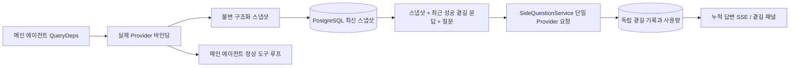

# ARTEX `/btw`

초보 안내: `/btw` 는 메인 에이전트(사람과의 대화)나 워커가 이미 가진 맥락으로 곁에서 질문하는 기능입니다. 탐색 그래프의 의도나 자산을 바꾸지 않고, 도구도 실행하지 않습니다.

일반 채팅, 작업 MainAgent, 그리고 그 작업 자신의 Worker 가 독립 곁길 질문을 지원합니다. 메인 입력칸에 `/btw 질문` 을 넣으면 제출됩니다. 빈 `/btw` 나 「곁길 질문」 버튼은 기록을 엽니다. 데스크톱은 너비를 조절할 수 있는 옆 패널, 모바일은 Drawer 를 씁니다.

곁길 답은 제출 시점의 에이전트 맥락 스냅샷으로 만듭니다. 스트리밍 표시, 이어 묻기, 중지, 비우기를 지원합니다. 패널을 닫거나, 페이지를 새로고치거나, SSE 가 끊겨도 모델 요청은 취소되지 않습니다. 중지는 현재 곁길에만 영향을 줍니다. 비우기는 곁길을 취소하고 곁길 기록을 지우며, 메인 맥락 스냅샷은 남깁니다.

## 구현 경계

Go, norma v0.3.7, Next.js, 기존 Markdown / ResizablePanel / Drawer / AlertDialog 컴포넌트를 그대로 씁니다. norma 소스를 고치지 않았고, 곁길용 의존성도 추가하지 않았습니다. Planner, 다른 작업에서 물려받은 Worker, 도구형 하위 작업 승격은 이번 범위가 아닙니다.

- `capture.go` 는 `Options.Deps.CallModel / CallModelSync` 에서만 메인 루프 요청을 표시합니다. Provider 장식은 구체 모델 안, 라우팅 풀이 고른 뒤에 있으므로 실제로 선택된 모델을 기록합니다. 압축과 요약 요청은 스냅샷을 덮지 않습니다.
- 요청 시작, 완전한 모델 답, 실행 종료 상태가 스냅샷을 발행합니다. 생성 중인 반쪽 답은 발행하지 않습니다. 도구 호출은 norma 의 `MessagesForAPI` 로 짝을 유지하고, 도구 결과는 다음 메인 모델 요청이나 실행 종료 때 스냅샷에 들어갑니다. 스트리밍 중단은 이전의 유효한 경계를 남깁니다.
- 스냅샷은 JSON 깊은 복사로 구조화 메시지, 시스템 프롬프트, 도구 정의, 생성 파라미터를 보존합니다. 모델 추론은 스냅샷 잠금이나 데이터베이스 트랜잭션을 잡지 않습니다.
- `SideQuestionService` 는 구체 Provider 를 호출합니다. 필요하면 곁길 요약을 먼저 만들고, 최종 답은 처음 맥락 한도를 넘었고 아직 텍스트나 도구 호출을 내지 않았을 때만 줄인 뒤 한 번 재시도할 수 있습니다. agent session 을 만들지 않고, 도구 실행기, 메인 transcript, 활동 스트림, 작업 그래프에 붙지 않으며, 작업 모델 전환 사슬도 타지 않습니다. 답에 도구 정의를 남기는 것은 기존 구조화 도구 맥락과 맞추기 위해서입니다. 요약 요청은 도구를 주지 않습니다. 새로 돌아온 도구 호출에는 실행 경로가 없습니다.
- 부모 세션마다 실행 요청은 하나, 서비스 프로세스당 최대 넷, 한 번 시간 제한은 120초입니다. 곁길은 서비스 수명 아래의 독립 취소 맥락을 씁니다.
- 곁길 요청은 모델 설정 참조와 민감하지 않은 신원 요약을 남깁니다. 요청할 때 기존 설정에서 자격 증명을 가져옵니다. 설정이 지워졌거나 모델, 프로토콜, 주소 같은 신원 필드가 바뀌면 먼저 메인 에이전트를 돌려 스냅샷을 갱신해야 합니다. 테스트는 제품 기본 모델을 바꾸지 않습니다.

## 저장과 복구

`db/schema.sql` 이 `side_question_sessions` 와 `side_question_requests` 를 자동으로 만듭니다. 전자는 부모 자원, 최신 스냅샷, 실행 번호, 버전, 정리 버전을 저장합니다. 후자는 질문, 누적 답, 상태, 모델, 스냅샷 시각, 사용량, 이벤트 순번, 페이지 순번을 저장합니다.

부모 세션 키는 conversation ID, 또는 task ID + exploration ID + intent ID 입니다. Worker 는 다시 쓸 수 있는 실행 슬롯 이름을 쓰지 않습니다.

스냅샷은 부모 세션 단위로 합쳐 쓰고, 250ms 마다 한 번 갱신합니다. 데이터베이스는 `(run_id, version)` 을 비교해 옛 버전이 덮어쓰지 못하게 합니다. 곁길을 제출하기 전에 고른 스냅샷을 다시 저장합니다. 저장에 성공하면 메모리의 큰 스냅샷을 놓습니다. 실패하면 쓸 버전을 남겨 둡니다. 누적 답은 스트리밍 이벤트가 올 때 최대 250ms 에 한 번 쓰고, 종료 상태는 즉시 저장하며 데이터베이스 오류가 있으면 제한적으로 재시도합니다.

서비스가 켜질 때 남아 있는 `running` 요청을 `interrupted` 로 표시합니다. 이미 저장된 부분 답과 사용량은 남기고, 요청을 자동으로 다시 보내지 않습니다. 최근에 저장된 맥락은 다음 질문에 바로 쓸 수 있습니다. 옛 세션에 스냅샷이 없으면 먼저 메인 에이전트를 실행해야 하며, UI 활동 기록으로 맥락을 다시 만들지 않습니다.

비우기는 정리 버전을 올리고 요청을 지웁니다. 조건 갱신이 늦은 콜백이 다시 쓰는 것을 막습니다. 물리 부모 자원 삭제는 외래 키 연쇄를 따릅니다. Worker 논리 삭제는 같은 트랜잭션에서 곁길 데이터를 지우고, 그 뒤 늦은 스냅샷을 거절합니다. 작업 아카이브는 먼저 새 요청을 막고, 메인 흐름이 멈추기를 기다리고, 곁길을 취소한 뒤 저장이 끝나기를 기다립니다. 아카이브 형식은 v3 이고, 곁길 표가 없는 v1/v2 도 호환합니다.

기록은 전부 저장하고, 순번 커서로 한 페이지에 최대 20건을 돌려줍니다. 모델 요청은 최근 성공 문답 원문 최대 20조를 다시 재생하고, token 예산으로 재생량을 제한합니다. 더 오래된 문답은 별도의 굴러가는 요약을 유지합니다. 메인 맥락이 예산을 넘으면 곁길 사본의 오래된 부분만 요약하고, 최근의 구조화 도구 호출과 결과는 남깁니다. 요약, 준비 진행, 사용량은 곁길의 동시성, 취소, 120초 제한에 함께 들어갑니다. 자세한 내용은 [맥락 예산과 오픈소스 참고](CONTEXT_BUDGET.md)를 보세요.

## HTTP 계약

아래 경로가 `{parent}` 입니다. 기존 인증과 자원 검사를 그대로 씁니다.

- `/api/conversations/{id}`
- `/api/tasks/{id}/chat`
- `/api/tasks/{id}/intents/{iid}`

| 요청 | 반환과 동작 |
| --- | --- |
| `GET {parent}/side-questions?before={ordinal}` | `items` 는 새것부터, 독립 `current` 실행 상태, `snapshot` 메타, `next_cursor`. 커서가 0 이면 최신 페이지이거나 다음 페이지가 없음 |
| `POST {parent}/side-questions` | JSON `{ "question": "…", "client_request_id": "UUID" }`. 새 요청은 202 와 요청 객체. 같은 ID 와 질문이면 기존 객체 200 |
| `DELETE {parent}/side-questions` | 현재 부모 세션의 곁길 문답을 취소하고 비움 |
| `GET /api/side-questions/{requestID}/events` | `snapshot` SSE 이벤트. `id` 는 증가하는 순번, `data` 는 누적된 전체 요청 객체. 비우면 `cleared` 를 보냄 |
| `POST /api/side-questions/{requestID}/cancel` | 명시적 취소. 종료 상태는 기록이나 SSE 에서 읽음 |

질문 상한은 4000자입니다. 스냅샷이 없거나, 모델 설정이 바뀌었거나, 같은 부모 세션이 바쁘거나, 멱등 ID 가 충돌하면 409 입니다. 전역 동시 상한은 429 입니다. SSE 연결마다 먼저 누적 상태를 보내며, 클라이언트가 예전에 받은 텍스트 조각에 의존하지 않습니다. 프론트는 요청 ID + 순번으로 합치고, 부모 세션을 바꾸거나 비울 때 옛 콜백을 버립니다.

## 검증과 참고

자동 검사, 실제 모델 사용, 알려진 제한은 [VALIDATION.md](VALIDATION.md)에 있습니다.

독립 요청은 [Grok CLI side-question.ts(고정 커밋)](https://github.com/superagent-ai/grok-cli/blob/fb97af83f06dca873281d60168430f06c8de6324/src/utils/side-question.ts)를, 실행 격리는 [OpenCode(고정 커밋)](https://github.com/anomalyco/opencode/tree/b3f1a96c6dd7adeb28b36dd11add1998fc84d67b)를 참고했습니다. ARTEX 의 맥락은 norma 의 구조화 메시지를 쓰며, 프론트 로그를 이어 붙여 텍스트를 만들지 않습니다.
